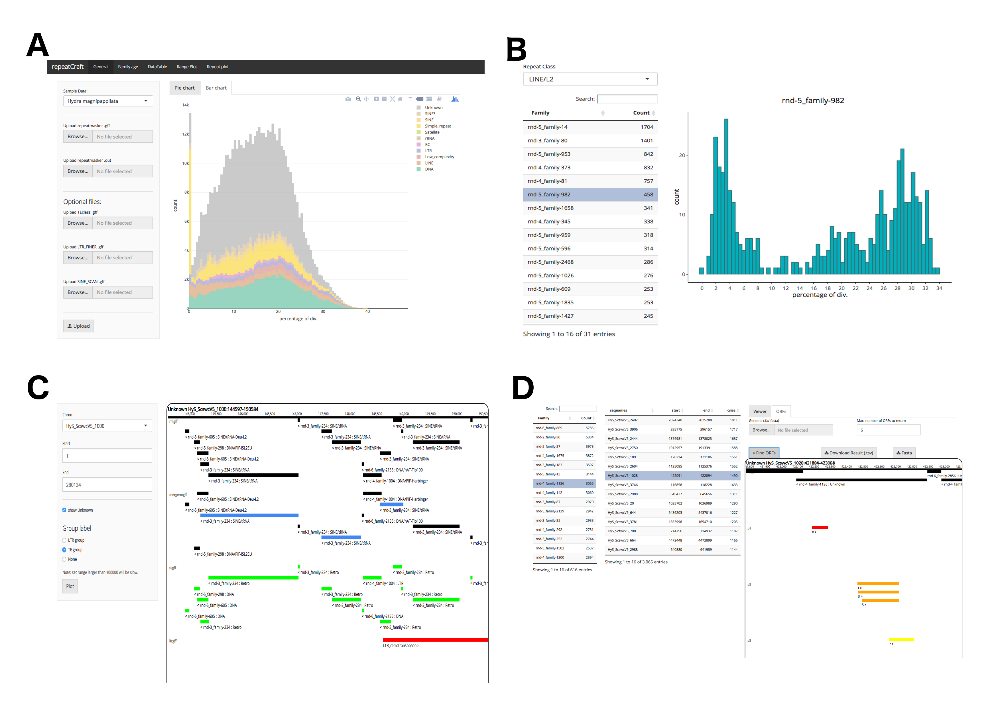

# repeatCraft
repeatCraft is a Shiny application designed to visualise the result from [RepeatCraft pipeline](https://github.com/niccw/repeatcraftp). User can run RepeatCraft pipeline through this web application, starting from  RepeatMasker GFF, OUT. 

In addition to visualise the result of defragmentation from RepeatCraft pipeline , the web application also allow interactive analysis on:
1) Age estimation by repeat class/ family
2) Annotation difference by different tools (currently support LTR_FINER, TEclass, SINE_scan)
3) Structural features of repeat elements (detect and visualise the Open Reading Frames (ORFs)) of specific copy of repeat family

repeatCraft is also available at http://131.130.65.134:3838/repeatcraft.

#### Installation
```R
if (!require(remotes)) { install.packages("remotes") }
remotes::install_github("niccw/repeatCraft")
```

#### Run repeatCraft from R
```R
repeatcraft::runApp()
```

#### Screenshots



It is recommended to chunk your input GFF and OUT files by chromosome if they are larger than 50 mb, repeatCraft would take a long time (few minutes) to process them.
